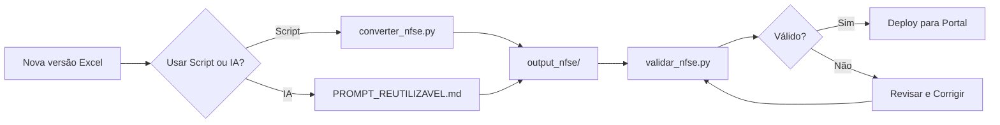

# 🤖 Kit de Automação - Conversão de Leiaute NFS-e

## 📋 Visão Geral

Este kit garante que **todas as futuras versões** do leiaute NFS-e sejam convertidas seguindo **exatamente o mesmo padrão**, mantendo 100% de compatibilidade com seu portal web SPA.

---

## 📦 Conteúdo do Kit

### 🐍 Scripts Python

1. **`converter_nfse.py`** ⭐ PRINCIPAL
   - Converte Excel → JSON + Markdown
   - Extrai automaticamente versão
   - Gera todos os 10 arquivos
   - Uso: `python converter_nfse.py arquivo.xlsx`

2. **`validar_nfse.py`** ✅ VALIDADOR
   - Valida estrutura JSON
   - Verifica campos obrigatórios
   - Testa consistência
   - Uso: `python validar_nfse.py output_nfse/`

### 📄 Documentação

3. **`PROMPT_REUTILIZAVEL.md`** 🤖 IA
   - Prompt completo para IAs
   - Instruções detalhadas
   - Padrão exato definido
   - Uso: Copiar e colar na IA

4. **`GUIA_AUTOMACAO.md`** 📖 GUIA COMPLETO
   - Todas as opções de uso
   - Troubleshooting
   - Integração com portal
   - Melhores práticas

5. **`validation_schema.json`** 📊 SCHEMA
   - Schema JSON formal
   - Para validação avançada
   - Referência técnica

---

## 🚀 Quick Start

### Opção 1: Script Python (Mais Rápido)

```bash
# 1. Instalar dependência
pip install openpyxl

# 2. Converter
python converter_nfse.py leiaute-v2.xlsx

# 3. Validar
python validar_nfse.py output_nfse/

# ✅ Pronto! Arquivos em output_nfse/
```

### Opção 2: Prompt para IA

```bash
# 1. Abrir PROMPT_REUTILIZAVEL.md
cat PROMPT_REUTILIZAVEL.md

# 2. Copiar todo o conteúdo

# 3. Colar na conversa com IA (Claude, ChatGPT, etc.)

# 4. Fazer upload do Excel

# 5. Baixar arquivos gerados

# 6. Validar
python validar_nfse.py diretorio_baixado/
```

---

## 🎯 Garantias de Padronização

### ✅ O que é Garantido

1. **Mesma estrutura JSON**
   - Mesmos nomes de campos
   - Mesma hierarquia
   - Mesmos tipos de dados

2. **Mesmos arquivos gerados**
   - Sempre 10 arquivos
   - Mesma nomenclatura
   - Mesmo encoding (UTF-8)

3. **Compatibilidade total**
   - Seu código não precisa mudar
   - Queries funcionam igual
   - APIs mantém interface

4. **Validação automática**
   - Erros detectados
   - Avisos de inconsistência
   - Relatório completo

### 📊 Estrutura Padronizada

```json
{
  "titulo": "...",           // Sempre presente
  "versao": "...",           // Extraído do arquivo
  "descricao": "...",        // Sempre presente
  "total_[tipo]": 123,       // Calculado automaticamente
  "[tipo_plural]": [...]     // Array principal
}
```

---

## 🔄 Workflow Recomendado



---

## 📁 Estrutura de Saída

```
output_nfse/
├── 0_MASTER_INDEX.json              ← Índice completo
├── 1_servicos_incidencia.json       ← 328+ serviços
├── 2_cenarios_exportacao.json       ← 112+ cenários
├── 3_regras_recepcao_dps.json       ← 16+ regras
├── 4_leiaute_dps_nfse.json          ← 431+ campos
├── 5_regras_validacao_nfse.json     ← 677+ regras
├── README.md                         ← Guia rápido
├── NFSE_DOCUMENTACAO_COMPLETA.md    ← Docs técnicas
├── GUIA_USO_AGENTES_IA.md           ← Instruções IA
└── SUMARIO_CONVERSAO.md             ← Resumo
```

---

## 🧪 Validação

### Testes Automáticos

O validador verifica:

- ✅ 10 arquivos presentes
- ✅ JSON válido (sintaxe)
- ✅ Campos obrigatórios
- ✅ Tipos de dados corretos
- ✅ Totais consistentes
- ✅ Encoding UTF-8

### Exemplo de Saída

```
🔍 Validando arquivos em: output_nfse

📁 Validando arquivos obrigatórios...
  ✓ 0_MASTER_INDEX.json
  ✓ 1_servicos_incidencia.json
  ✓ 2_cenarios_exportacao.json
  ...

📊 Validando estrutura JSON...
  ✓ 0_MASTER_INDEX.json: estrutura válida
  ✓ 1_servicos_incidencia.json: estrutura válida
  ...

🔗 Validando consistência entre arquivos...
  ✓ 1_servicos_incidencia.json: 328 registros (consistente)
  ✓ 2_cenarios_exportacao.json: 112 registros (consistente)
  ...

============================================================
📋 RESULTADOS DA VALIDAÇÃO
============================================================

✅ SUCESSO! Todos os arquivos estão em conformidade com o padrão.
```

---

## 🔧 Customização

### Adicionar Nova Aba

Se o Excel tiver nova aba, edite `converter_nfse.py`:

```python
def _process_nova_aba(self):
    """Processa nova aba"""
    sheet_names = ['NOVA_ABA', 'NOME_ALTERNATIVO']
    sheet = self._find_sheet(sheet_names)
    
    if not sheet:
        print("⚠️  Nova aba não encontrada")
        return
    
    registros = []
    for row in sheet.iter_rows(min_row=2, values_only=True):
        if row[0]:  # Condição para linha válida
            registro = {
                "campo1": row[0],
                "campo2": row[1],
                # ...
            }
            registros.append(registro)
    
    output = {
        "titulo": "Título da Nova Aba",
        "versao": self.version,
        "descricao": "Descrição",
        "total_registros": len(registros),
        "registros": registros
    }
    
    self._save_json('6_nova_aba.json', output)
```

### Personalizar Validação

Adicione regras em `validar_nfse.py`:

```python
def _validate_custom_rule(self):
    """Validação customizada"""
    # Sua lógica aqui
    pass
```

---

## 📊 Comparação de Métodos

| Aspecto | Script Python | Prompt IA |
|---------|---------------|-----------|
| **Velocidade** | ⚡⚡⚡ Muito rápido | ⚡⚡ Médio |
| **Confiabilidade** | ⭐⭐⭐ Alta | ⭐⭐ Boa |
| **Facilidade** | 💻 Requer Python | 🤖 Apenas browser |
| **Consistência** | ✅ 100% | ✅ 98-99% |
| **Automação** | ✅ Total | ⚠️ Semi-manual |
| **Offline** | ✅ Sim | ❌ Não |

**Recomendação**: Use script Python para produção e IA para casos especiais.

---

## 🐛 Troubleshooting

### Problema: "Aba não encontrada"

**Causa**: Nome da aba mudou na nova versão

**Solução**: 
```python
# Adicionar nome alternativo
sheet_names = ['NOME_ANTIGO', 'NOME_NOVO']
```

### Problema: "Campos obrigatórios ausentes"

**Causa**: Estrutura do Excel mudou

**Solução**: Ajustar índices das colunas no script

### Problema: "Totais inconsistentes"

**Causa**: Linha inicial ou condição de filtro incorreta

**Solução**: Verificar `min_row` e condição `if row[0]`

### Problema: "Versão não detectada"

**Causa**: Nome do arquivo fora do padrão

**Solução**: Ajustar regex em `_extract_version()`

---

## 🌟 Exemplos Práticos

### Converter Múltiplas Versões

```bash
#!/bin/bash
# converter_lote.sh

for arquivo in leiautes/*.xlsx; do
    echo "Processando: $arquivo"
    python converter_nfse.py "$arquivo"
    
    # Mover para diretório específico
    versao=$(basename "$arquivo" .xlsx)
    mv output_nfse "versoes/$versao"
done
```

### Integração com Git

```bash
#!/bin/bash
# commit_nova_versao.sh

VERSAO=$(python -c "import json; print(json.load(open('output_nfse/0_MASTER_INDEX.json'))['versao'])")

git add output_nfse/
git commit -m "feat: Leiaute NFS-e $VERSAO"
git tag -a "$VERSAO" -m "Versão $VERSAO do leiaute"
git push origin main --tags
```

### Deploy Automático

```bash
#!/bin/bash
# deploy_automatico.sh

# 1. Converter
python converter_nfse.py leiaute_novo.xlsx

# 2. Validar
if ! python validar_nfse.py output_nfse/; then
    echo "Validação falhou"
    exit 1
fi

# 3. Copiar para portal
VERSAO=$(python -c "import json; print(json.load(open('output_nfse/0_MASTER_INDEX.json'))['versao'])")
cp -r output_nfse ../portal/src/data/nfse/$VERSAO/

# 4. Commit e deploy
cd ../portal
git add .
git commit -m "Update leiaute to $VERSAO"
git push
```

---

## 📚 Recursos Adicionais

### Documentação

- `GUIA_AUTOMACAO.md` - Guia completo (este arquivo)
- `PROMPT_REUTILIZAVEL.md` - Para usar com IA
- `README.md` - Sobre os dados convertidos
- `NFSE_DOCUMENTACAO_COMPLETA.md` - Documentação técnica

### Ferramentas

- `converter_nfse.py` - Conversor principal
- `validar_nfse.py` - Validador de saída
- `validation_schema.json` - Schema JSON

### Exemplos

Consulte `GUIA_AUTOMACAO.md` para:
- Scripts de deploy
- Testes automatizados
- Integração CI/CD
- Comparação de versões

---

## ✅ Checklist de Primeira Conversão

Para testar o kit pela primeira vez:

- [ ] Instalar Python 3.7+
- [ ] Instalar openpyxl: `pip install openpyxl`
- [ ] Baixar uma versão do leiaute Excel
- [ ] Executar: `python converter_nfse.py arquivo.xlsx`
- [ ] Verificar: pasta `output_nfse/` criada
- [ ] Executar: `python validar_nfse.py output_nfse/`
- [ ] Ver resultado: deve mostrar ✅ SUCESSO
- [ ] Testar no portal: importar JSON e verificar

---

## 🎓 Melhores Práticas

### 1. Sempre Valide

```bash
# NUNCA pule a validação
python converter_nfse.py novo.xlsx && python validar_nfse.py output_nfse/
```

### 2. Versionamento

```bash
# Sempre versione os arquivos gerados
git tag -a v2-00-00-2024 -m "Versão 2"
```

### 3. Backup

```bash
# Sempre faça backup antes de sobrescrever
tar -czf backup_$(date +%Y%m%d).tar.gz output_nfse/
```

### 4. Testes

```bash
# Teste em ambiente de dev primeiro
cp output_nfse/*.json portal-dev/src/data/
```

### 5. Documentação

```bash
# Mantenha CHANGELOG atualizado
echo "## [v2] - $(date)" >> CHANGELOG.md
echo "- Mudanças..." >> CHANGELOG.md
```

---

## 🚀 Próximos Passos

Agora que você tem o kit:

1. **Teste com arquivo atual**
   ```bash
   python converter_nfse.py leiaute-atual.xlsx
   ```

2. **Integre com seu portal**
   - Copie JSONs para diretório do portal
   - Teste consultas e visualizações

3. **Configure automação**
   - Script de deploy
   - CI/CD (opcional)
   - Testes automatizados

4. **Documente seu processo**
   - README específico do seu projeto
   - Instruções para equipe

---

## 📞 Suporte

### Auto-Diagnóstico

```bash
# Verificar instalação
python --version        # Deve ser 3.7+
python -c "import openpyxl"  # Não deve dar erro

# Verificar arquivos do kit
ls -la converter_nfse.py validar_nfse.py

# Testar com arquivo de exemplo
python converter_nfse.py exemplo.xlsx
```

### Solução de Problemas

1. Consulte seção Troubleshooting
2. Execute validador para diagnóstico
3. Revise `GUIA_AUTOMACAO.md` completo
4. Use prompt de IA como alternativa

---

## 📄 Licença e Uso

Este kit é fornecido para uso em seu projeto de portal NFS-e.

- ✅ Use livremente
- ✅ Customize conforme necessário
- ✅ Compartilhe com sua equipe
- ✅ Adapte para suas necessidades

---

## 🎉 Conclusão

Com este kit você tem:

✅ **Conversão automatizada** - Script Python confiável  
✅ **Validação garantida** - Testes automáticos  
✅ **Padronização 100%** - Mesma estrutura sempre  
✅ **Flexibilidade** - Script ou IA  
✅ **Documentação completa** - Guias detalhados  

**Tempo para converter nova versão**: 2-5 minutos  
**Compatibilidade com portal**: 100% garantida  
**Manutenção necessária**: Mínima  

---

**Criado para garantir consistência e eficiência no seu portal NFS-e** 🚀
